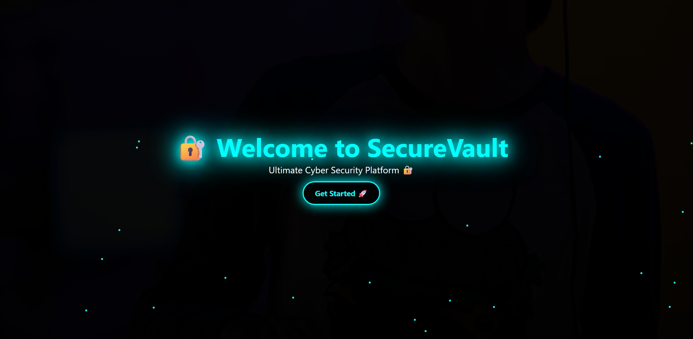
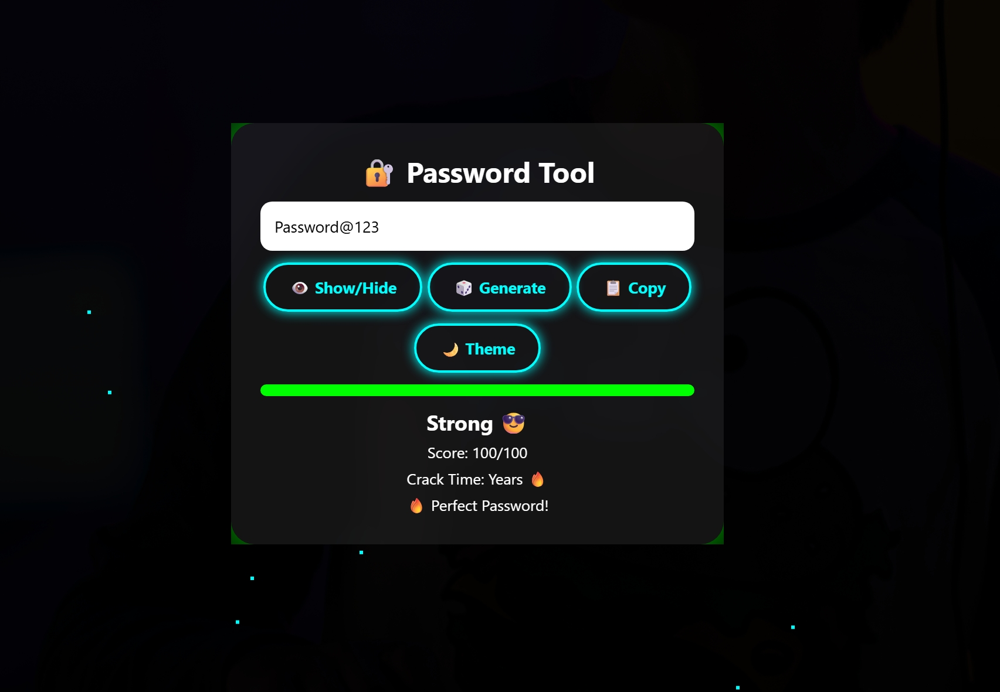

# 🔐 SecureVault

SecureVault is a web-based password security tool that helps users check how strong their passwords are.

It analyzes the password in real-time and shows a strength score along with useful suggestions to improve it. The goal is to make users more aware of how secure (or weak) their passwords actually are.

---

## 🚀 Features

### 🔐 Password Strength Checker
The tool checks your password based on:
- Length (minimum 8 characters)
- Use of uppercase letters
- Numbers
- Special characters  

It then gives a score from 0–100.

---

### 📊 Visual Feedback
A progress bar shows how strong the password is:
- 🔴 Weak  
- 🟠 Medium  
- 🟢 Strong  

This makes it easy to understand instantly.

---

### 🤖 Smart Suggestions
If the password is weak, the tool suggests improvements like:
- Adding uppercase letters  
- Using numbers  
- Including special characters  

It may also suggest a stronger version of your password.

---

### ⏳ Crack Time Estimation
The app shows how long it might take to crack your password:
- Seconds (very weak)  
- Hours (medium)  
- Years (strong)  

---

### 🎲 Password Generator
You can generate a strong random password with one click.

---

### 📋 Copy Feature
Easily copy your password using the copy button.

---

### 🌙 Theme Toggle
Switch between light and dark mode.

---

### 🌌 UI & Design
- Cyber-style theme  
- Glowing buttons  
- Animated background  
- Smooth transitions  

---

## 🖼️ Preview

### Welcome Screen

### Password Tool

---  

## 🛠️ Tech Used

- HTML  
- CSS  
- JavaScript  

---

## 🎯 Why I Built This

I created this project to practice frontend development and learn how password security works.

It also helped me improve my UI design skills and understand how to give real-time feedback to users.

---

## 🌍 Live Demo

https://your-username.github.io/securevault/

---

## 👨‍💻 Author

**Kavya Kushwaha**

---

## ⭐

If you like this project, consider giving it a star 🙂
